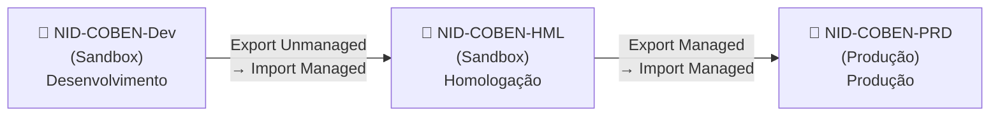
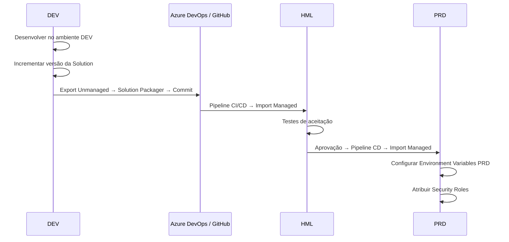
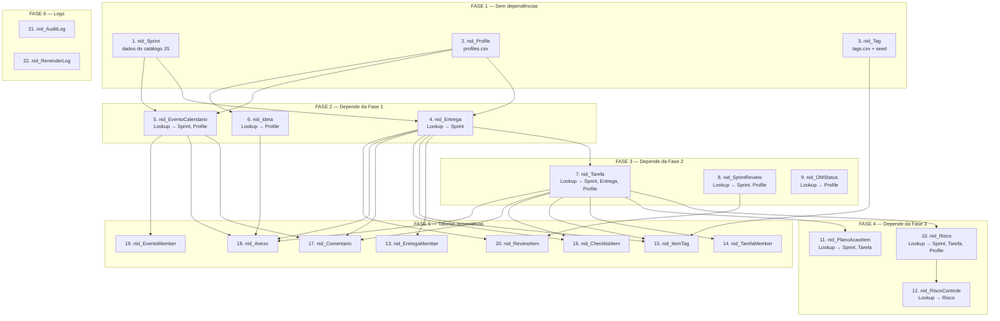

# NID/COBEN Agile Board — Blueprint Corporativo Dataverse

> **Versão**: 1.0  
> **Data**: 2026-09-14  
> **Prefixo Publisher**: `nid`  
> **Solution**: `NIDAgileBoard`  
> **Ambientes**: DEV · HML · PRD

---

## Sumário

1. [Estrutura da Solution](#1-estrutura-da-solution)
2. [Inventário de Tabelas](#2-inventário-de-tabelas)
3. [Choices Globais](#3-choices-globais)
4. [Especificação Detalhada por Tabela](#4-especificação-detalhada-por-tabela)
5. [Mapa de Relacionamentos](#5-mapa-de-relacionamentos)
6. [Business Rules](#6-business-rules)
7. [Security Roles](#7-security-roles)
8. [Environment Variables](#8-environment-variables)
9. [ALM — DEV · HML · PRD](#9-alm)
10. [Plano de Importação de Dados](#10-plano-de-importação-de-dados)
11. [Estrutura para Power Apps / Automate / BI / Teams / Copilot](#11-estrutura-para-consumidores)
12. [Power Platform CLI / Solution Packager](#12-power-platform-cli)

---

## 1. Estrutura da Solution

### 1.1 Publisher

| Propriedade | Valor |
|------------|-------|
| Display Name | NID COBEN |
| Name | nidcoben |
| Prefix | `nid` |
| Option Value Prefix | 10000 |

### 1.2 Solution

| Propriedade | Valor |
|------------|-------|
| Display Name | NID Agile Board |
| Unique Name | `NIDAgileBoard` |
| Version | 1.0.0.0 |
| Publisher | NID COBEN (`nidcoben`) |
| Managed | Não (unmanaged em DEV; exportar managed para HML/PRD) |

### 1.3 Componentes da Solution

```
NIDAgileBoard (Solution)
├── Tables (22)
│   ├── nid_Sprint
│   ├── nid_Profile
│   ├── nid_Tag
│   ├── nid_Entrega
│   ├── nid_EntregaMember
│   ├── nid_Tarefa
│   ├── nid_TarefaMember
│   ├── nid_ItemTag
│   ├── nid_ChecklistItem
│   ├── nid_Comentario
│   ├── nid_Anexo
│   ├── nid_SprintReview
│   ├── nid_ReviewItem
│   ├── nid_EventoCalendario
│   ├── nid_EventoMember
│   ├── nid_AuditLog
│   ├── nid_PlanoAcaoItem
│   ├── nid_OMStatus
│   ├── nid_Ideia
│   ├── nid_Risco
│   ├── nid_RiscoControle
│   └── nid_ReminderLog
├── Choices (Global Option Sets) (14)
│   ├── nid_StatusTarefa
│   ├── nid_Prioridade
│   ├── nid_Fase
│   ├── nid_TipoUsuario
│   ├── nid_Senioridade
│   ├── nid_PapelMembro
│   ├── nid_TipoTag
│   ├── nid_StatusSprint
│   ├── nid_TipoEvento
│   ├── nid_Recorrencia
│   ├── nid_DisposicaoReview
│   ├── nid_AbordagemRisco
│   ├── nid_StatusRisco
│   ├── nid_NivelResidualRisco
│   ├── nid_VinculoTipo
│   ├── nid_TipoIdeia
│   ├── nid_StatusIdeia
│   └── nid_CanalLembrete
├── Security Roles (5)
│   ├── NID Admin
│   ├── NID Coordenador
│   ├── NID Gestor
│   ├── NID Integrante
│   └── NID Visitante
├── Business Rules (6)
├── Environment Variables (8)
├── Canvas App (1) — NID Agile Board
├── Cloud Flows (Power Automate) (8+)
├── Connection References (4)
└── Dashboards (Power BI embed) (3)
```

---

## 2. Inventário de Tabelas

| # | Nome Lógico | Nome de Exibição | Descrição | Propriedade do Registro | Coluna Primária | Colunas | Supabase Origem |
|---|------------|-----------------|-----------|------------------------|----------------|---------|----------------|
| 1 | `nid_sprint` | Sprint | Ciclos de trabalho ágil 2026–2027 com período, status e indicador de risco | Organização | `nid_nome` | 8 | NOVA (catálogo JS) |
| 2 | `nid_profile` | Profile | Perfil complementar do membro NID, vinculado ao Entra ID | Usuário ou Equipe | `nid_nome` | 16 | `profiles` |
| 3 | `nid_tag` | Tag | Rótulos categorizados para tarefas e entregas (área e custom) | Organização | `nid_nome` | 5 | `tags` |
| 4 | `nid_entrega` | Entrega | Entregas planejadas por sprint com status, fase e progresso | Usuário ou Equipe | `nid_nome` | 14 | `sprint_entregas` |
| 5 | `nid_entregamember` | Entrega Member | Vinculação entre membro e entrega | Organização | `nid_nome` | 4 | `entrega_members` |
| 6 | `nid_tarefa` | Tarefa | Subtarefas e tarefas autônomas com ciclo, prioridade e story points | Usuário ou Equipe | `nid_titulo` | 14 | `subtarefas` |
| 7 | `nid_tarefamember` | Tarefa Member | Atribuição de membros a tarefas com papel (executor/revisor/observador) | Organização | `nid_nome` | 5 | `task_members` |
| 8 | `nid_itemtag` | Item Tag | Vinculação de tags a tarefas ou entregas | Organização | `nid_nome` | 5 | `task_tags` |
| 9 | `nid_checklistitem` | Checklist Item | Item de checklist de tarefa ou entrega | Organização | `nid_texto` | 7 | `checklist_items` |
| 10 | `nid_comentario` | Comentário | Comentário em tarefa, entrega ou evento de calendário | Usuário ou Equipe | `nid_resumo` | 8 | `task_comments` |
| 11 | `nid_anexo` | Anexo | Arquivo anexado a tarefa, entrega, evento ou ideia | Usuário ou Equipe | `nid_nome` | 14 | `task_attachments` |
| 12 | `nid_sprintreview` | Sprint Review | Cerimônia de revisão do sprint com métricas e retrospectiva | Usuário ou Equipe | `nid_nome` | 13 | `sprint_reviews` |
| 13 | `nid_reviewitem` | Review Item | Disposição de cada entrega dentro de uma review | Organização | `nid_nome` | 7 | `sprint_review_items` |
| 14 | `nid_eventocalendario` | Evento Calendário | Reuniões, atividades e weeklies com recorrência | Usuário ou Equipe | `nid_titulo` | 15 | `calendar_events` |
| 15 | `nid_eventomember` | Evento Member | Participante de evento de calendário | Organização | `nid_nome` | 4 | `event_members` |
| 16 | `nid_auditlog` | Audit Log | Registro imutável de ações do sistema para governança | Organização | `nid_resumo` | 9 | `audit_log` |
| 17 | `nid_planoacaoitem` | Plano de Ação Item | Estado e vínculo de cada subação do PA COBEN — Gestão de Benefício | Organização | `nid_nome` | 10 | `pa_items` |
| 18 | `nid_omstatus` | OM Status | Estado de descontinuação de Oportunidade de Melhoria (OM) | Organização | `nid_nome` | 7 | `pa_om_status` |
| 19 | `nid_ideia` | Ideia | Projetos embrionários, cursos, workshops e aprendizado | Usuário ou Equipe | `nid_titulo` | 9 | `ideias` |
| 20 | `nid_risco` | Risco | Risco organizacional COBEN com controles e nível residual | Usuário ou Equipe | `nid_titulo` | 15 | `riscos` |
| 21 | `nid_riscocontrole` | Risco Controle | Controle associado a um risco (preventivo/detectivo/corretivo) | Organização | `nid_descricao` | 5 | `riscos.controles` (JSONB) |
| 22 | `nid_reminderlog` | Reminder Log | Histórico de lembretes automáticos enviados | Organização | `nid_resumo` | 7 | `reminder_log` |

---

## 3. Choices Globais

Todos os Choices são criados como **Global Option Sets** na Solution para reutilização cross-table.

### 3.1 nid_StatusTarefa

| Código | Label | Cor Sugerida |
|--------|-------|-------------|
| 100000000 | Pendente | `#94a3b8` |
| 100000001 | Em Andamento | `#2B6AFF` |
| 100000002 | Em Revisão | `#F5A524` |
| 100000003 | Concluído | `#22D172` |
| 100000004 | Bloqueado | `#FF4757` |
| 100000005 | Despriorizado | `#64748b` |
| 100000006 | Cancelado | `#ef4444` |

**Usado em**: `nid_Entrega.nid_status`, `nid_Tarefa.nid_status`

### 3.2 nid_Prioridade

| Código | Label | Cor Sugerida |
|--------|-------|-------------|
| 100000000 | Crítica | `#FF4757` |
| 100000001 | Alta | `#FF7B39` |
| 100000002 | Média | `#F5A524` |
| 100000003 | Baixa | `#22D172` |

**Usado em**: `nid_Entrega.nid_prioridade`, `nid_Tarefa.nid_prioridade`

### 3.3 nid_Fase

| Código | Label |
|--------|-------|
| 100000000 | Ideação |
| 100000001 | Business Case |
| 100000002 | Planejamento |
| 100000003 | Execução |
| 100000004 | Homologação |
| 100000005 | Implantação |
| 100000006 | Encerramento |

**Usado em**: `nid_Entrega.nid_fase`, `nid_Tarefa.nid_fase`

### 3.4 nid_TipoUsuario

| Código | Label |
|--------|-------|
| 100000000 | Admin |
| 100000001 | Integrante |
| 100000002 | Gestor |
| 100000003 | Coordenador |
| 100000004 | Visitante |

**Usado em**: `nid_Profile.nid_tipousuario`

### 3.5 nid_Senioridade

| Código | Label |
|--------|-------|
| 100000000 | Estagiário |
| 100000001 | Júnior |
| 100000002 | Pleno |
| 100000003 | Sênior |
| 100000004 | Especialista |
| 100000005 | Coordenador |
| 100000006 | Gerente |

**Usado em**: `nid_Profile.nid_senioridade`

### 3.6 nid_PapelMembro

| Código | Label |
|--------|-------|
| 100000000 | Executor |
| 100000001 | Revisor |
| 100000002 | Observador |

**Usado em**: `nid_TarefaMember.nid_papel`

### 3.7 nid_TipoTag

| Código | Label |
|--------|-------|
| 100000000 | Área |
| 100000001 | Custom |

**Usado em**: `nid_Tag.nid_tipotag`

### 3.8 nid_StatusSprint

| Código | Label |
|--------|-------|
| 100000000 | Planejada |
| 100000001 | Em Andamento |
| 100000002 | Finalizada |

**Usado em**: `nid_Sprint.nid_statussprint`

### 3.9 nid_TipoEvento

| Código | Label |
|--------|-------|
| 100000000 | Reunião |
| 100000001 | Tarefa |
| 100000002 | Atividade |
| 100000003 | Weekly |
| 100000004 | Outro |

**Usado em**: `nid_EventoCalendario.nid_tipoevento`

### 3.10 nid_Recorrencia

| Código | Label |
|--------|-------|
| 100000000 | Semanal |
| 100000001 | Quinzenal |
| 100000002 | Mensal |
| 100000003 | Nenhuma |

**Usado em**: `nid_EventoCalendario.nid_recorrencia`

### 3.11 nid_DisposicaoReview

| Código | Label |
|--------|-------|
| 100000000 | Concluído |
| 100000001 | Remanejado |
| 100000002 | Fora |
| 100000003 | Pendente |
| 100000004 | Em Andamento |

**Usado em**: `nid_ReviewItem.nid_disposicao`

### 3.12 nid_AbordagemRisco

| Código | Label |
|--------|-------|
| 100000000 | Operacional |
| 100000001 | Organizacionais |

**Usado em**: `nid_Risco.nid_abordagem`

### 3.13 nid_StatusRisco

| Código | Label |
|--------|-------|
| 100000000 | Manutenção |
| 100000001 | Mitigação |
| 100000002 | Aceito |
| 100000003 | Transferido |
| 100000004 | Eliminado |

**Usado em**: `nid_Risco.nid_statusrisco`

### 3.14 nid_NivelResidualRisco

| Código | Label | Cor Sugerida |
|--------|-------|-------------|
| 100000000 | Baixo | `#22D172` |
| 100000001 | Moderado | `#F5A524` |
| 100000002 | Alto | `#FF7B39` |
| 100000003 | Extremo | `#FF4757` |

**Usado em**: `nid_Risco.nid_nivelresidual`

### 3.15 nid_VinculoTipo

| Código | Label |
|--------|-------|
| 100000000 | Entrega |
| 100000001 | Tarefa |

**Usado em**: `nid_PlanoAcaoItem.nid_vinculotipo`, `nid_Risco.nid_vinculotipo`

### 3.16 nid_TipoIdeia

| Código | Label |
|--------|-------|
| 100000000 | Ideia |
| 100000001 | Embrionário |
| 100000002 | Curso |
| 100000003 | Workshop |

**Usado em**: `nid_Ideia.nid_tipoideia`

### 3.17 nid_StatusIdeia

| Código | Label |
|--------|-------|
| 100000000 | Rascunho |
| 100000001 | Compartilhado |
| 100000002 | Em Avaliação |
| 100000003 | Aprovado |
| 100000004 | Arquivado |

**Usado em**: `nid_Ideia.nid_statusideia`

### 3.18 nid_CanalLembrete

| Código | Label |
|--------|-------|
| 100000000 | Teams |
| 100000001 | Email |

**Usado em**: `nid_ReminderLog.nid_canal`

### 3.19 nid_StatusEnvio

| Código | Label |
|--------|-------|
| 100000000 | Enviado |
| 100000001 | Erro |

**Usado em**: `nid_ReminderLog.nid_statusenvio`

---

## 4. Especificação Detalhada por Tabela

### 4.1 nid_Sprint

| # | Display Name | Logical Name | Tipo | Tamanho | Obrigatório | Default | Descrição |
|---|-------------|-------------|------|---------|-------------|---------|-----------|
| 1 | Nome | `nid_nome` | Single Line of Text | 200 | **Sim** | — | Primary Name. Ex: "Sprint 1 — Jun/Jul 2026" |
| 2 | Número | `nid_numero` | Whole Number | — | **Sim** | — | Identificador ordinal. Alternate Key. |
| 3 | Data Início | `nid_datainicio` | Date Only | — | **Sim** | — | Início do período |
| 4 | Data Fim | `nid_datafim` | Date Only | — | **Sim** | — | Fim do período |
| 5 | Status Sprint | `nid_statussprint` | Choice (`nid_StatusSprint`) | — | **Sim** | Planejada | Planejada / Em Andamento / Finalizada |
| 6 | Objetivo | `nid_objetivo` | Multiple Lines of Text | 4000 | Não | — | Objetivo qualitativo do sprint |
| 7 | Bloqueada | `nid_bloqueada` | Two Options | — | **Sim** | Não | Impede edição de registros vinculados |
| 8 | ID Legado Supabase | `nid_idlegadosupabase` | Single Line of Text | 50 | Não | — | UUID do Supabase para rastreio |

**Alternate Keys**: `nid_numero` (unique)

---

### 4.2 nid_Profile

| # | Display Name | Logical Name | Tipo | Tamanho | Obrigatório | Default | Descrição |
|---|-------------|-------------|------|---------|-------------|---------|-----------|
| 1 | Nome | `nid_nome` | Single Line of Text | 200 | **Sim** | — | Primary Name |
| 2 | Email | `nid_email` | Single Line of Text | 320 | **Sim** | — | Email institucional. Alternate Key. |
| 3 | Iniciais | `nid_iniciais` | Single Line of Text | 10 | **Sim** | — | Até 3 caracteres para avatar |
| 4 | Cor | `nid_cor` | Single Line of Text | 20 | **Sim** | `#2B6AFF` | Hex color para avatar |
| 5 | Área | `nid_area` | Single Line of Text | 100 | Não | `NID` | Área funcional |
| 6 | Cargo | `nid_cargo` | Single Line of Text | 200 | Não | — | Cargo institucional |
| 7 | Ativo | `nid_ativo` | Two Options | — | **Sim** | Sim | Membro ativo no NID |
| 8 | Tipo Usuário | `nid_tipousuario` | Choice (`nid_TipoUsuario`) | — | **Sim** | Integrante | Papel no sistema |
| 9 | Senioridade | `nid_senioridade` | Choice (`nid_Senioridade`) | — | Não | — | Nível profissional |
| 10 | Foto URL | `nid_fotourl` | Single Line of Text | 2000 | Não | — | URL da foto de perfil |
| 11 | Foto | `nid_foto` | Image | — | Não | — | Thumbnail 144×144 (nativo Dataverse) |
| 12 | Bio | `nid_bio` | Multiple Lines of Text | 4000 | Não | — | Biografia profissional |
| 13 | Habilidades | `nid_habilidades` | Multiple Lines of Text | 4000 | Não | `[]` | JSON array de strings |
| 14 | Projetos Liderados | `nid_projetosliderados` | Multiple Lines of Text | 4000 | Não | — | Texto descritivo |
| 15 | Usuário Entra ID | `nid_systemuserid` | Lookup → `systemuser` | — | Não | — | Vínculo com Entra ID |
| 16 | ID Legado Supabase | `nid_idlegadosupabase` | Single Line of Text | 50 | Não | — | UUID original |

**Alternate Keys**: `nid_email` (unique)

---

### 4.3 nid_Tag

| # | Display Name | Logical Name | Tipo | Tamanho | Obrigatório | Default | Descrição |
|---|-------------|-------------|------|---------|-------------|---------|-----------|
| 1 | Nome | `nid_nome` | Single Line of Text | 100 | **Sim** | — | Primary Name |
| 2 | Cor | `nid_cor` | Single Line of Text | 20 | **Sim** | — | Hex color |
| 3 | Tipo Tag | `nid_tipotag` | Choice (`nid_TipoTag`) | — | **Sim** | Área | Área ou Custom |
| 4 | ID Legado Supabase | `nid_idlegadosupabase` | Single Line of Text | 50 | Não | — | |

---

### 4.4 nid_Entrega

| # | Display Name | Logical Name | Tipo | Tamanho | Obrigatório | Default | Descrição |
|---|-------------|-------------|------|---------|-------------|---------|-----------|
| 1 | Nome | `nid_nome` | Single Line of Text | 300 | **Sim** | — | Primary Name |
| 2 | Sprint | `nid_sprintid` | Lookup → `nid_Sprint` | — | **Sim** | — | Sprint a que pertence |
| 3 | Entrega Idx | `nid_entregaidx` | Whole Number | — | **Sim** | — | Índice no catálogo |
| 4 | Status | `nid_status` | Choice (`nid_StatusTarefa`) | — | **Sim** | Pendente | |
| 5 | Prioridade | `nid_prioridade` | Choice (`nid_Prioridade`) | — | Não | Média | |
| 6 | Fase | `nid_fase` | Choice (`nid_Fase`) | — | Não | Execução | |
| 7 | Descrição | `nid_descricao` | Multiple Lines of Text | 4000 | Não | — | |
| 8 | Observação | `nid_obs` | Multiple Lines of Text | 4000 | Não | — | |
| 9 | Data Início | `nid_datainicio` | Date Only | — | Não | — | |
| 10 | Data Fim | `nid_datafim` | Date Only | — | Não | — | |
| 11 | Story Points | `nid_storypoints` | Whole Number | — | Não | — | |
| 12 | Progresso | `nid_progresso` | Whole Number | — | Não | 0 | Min: 0, Max: 100 |
| 13 | ID Legado Supabase | `nid_idlegadosupabase` | Single Line of Text | 50 | Não | — | |

**Alternate Keys**: (`nid_sprintid`, `nid_entregaidx`) composite

---

### 4.5 nid_EntregaMember

| # | Display Name | Logical Name | Tipo | Tamanho | Obrigatório | Default | Descrição |
|---|-------------|-------------|------|---------|-------------|---------|-----------|
| 1 | Nome | `nid_nome` | Single Line of Text | 200 | **Sim** | — | Primary Name (auto-populated) |
| 2 | Entrega | `nid_entregaid` | Lookup → `nid_Entrega` | — | **Sim** | — | |
| 3 | Profile | `nid_profileid` | Lookup → `nid_Profile` | — | **Sim** | — | |
| 4 | ID Legado Supabase | `nid_idlegadosupabase` | Single Line of Text | 50 | Não | — | |

---

### 4.6 nid_Tarefa

| # | Display Name | Logical Name | Tipo | Tamanho | Obrigatório | Default | Descrição |
|---|-------------|-------------|------|---------|-------------|---------|-----------|
| 1 | Título | `nid_titulo` | Single Line of Text | 500 | **Sim** | — | Primary Name |
| 2 | Sprint | `nid_sprintid` | Lookup → `nid_Sprint` | — | **Sim** | — | |
| 3 | Entrega | `nid_entregaid` | Lookup → `nid_Entrega` | — | Não | — | Entrega pai (se houver) |
| 4 | Descrição | `nid_descricao` | Multiple Lines of Text | 10000 | Não | — | Rich Text |
| 5 | Status | `nid_status` | Choice (`nid_StatusTarefa`) | — | **Sim** | Pendente | |
| 6 | Prioridade | `nid_prioridade` | Choice (`nid_Prioridade`) | — | **Sim** | Média | |
| 7 | Fase | `nid_fase` | Choice (`nid_Fase`) | — | **Sim** | Ideação | |
| 8 | Story Points | `nid_storypoints` | Whole Number | — | Não | — | |
| 9 | Data Início | `nid_datainicio` | Date Only | — | Não | — | |
| 10 | Data Fim | `nid_datafim` | Date Only | — | Não | — | |
| 11 | Progresso | `nid_progresso` | Whole Number | — | Não | 0 | Min: 0, Max: 100 |
| 12 | Criado Por (NID) | `nid_criadoporid` | Lookup → `nid_Profile` | — | Não | — | |
| 13 | ID Legado Supabase | `nid_idlegadosupabase` | Single Line of Text | 50 | Não | — | |

---

### 4.7 nid_TarefaMember

| # | Display Name | Logical Name | Tipo | Tamanho | Obrigatório | Default | Descrição |
|---|-------------|-------------|------|---------|-------------|---------|-----------|
| 1 | Nome | `nid_nome` | Single Line of Text | 200 | **Sim** | — | Auto-populated |
| 2 | Tarefa | `nid_tarefaid` | Lookup → `nid_Tarefa` | — | **Sim** | — | |
| 3 | Profile | `nid_profileid` | Lookup → `nid_Profile` | — | **Sim** | — | |
| 4 | Papel | `nid_papel` | Choice (`nid_PapelMembro`) | — | **Sim** | Executor | |
| 5 | ID Legado Supabase | `nid_idlegadosupabase` | Single Line of Text | 50 | Não | — | |

---

### 4.8 nid_ItemTag

| # | Display Name | Logical Name | Tipo | Tamanho | Obrigatório | Default | Descrição |
|---|-------------|-------------|------|---------|-------------|---------|-----------|
| 1 | Nome | `nid_nome` | Single Line of Text | 200 | **Sim** | — | Auto-populated |
| 2 | Tarefa | `nid_tarefaid` | Lookup → `nid_Tarefa` | — | Não | — | NULL se for tag de entrega |
| 3 | Entrega | `nid_entregaid` | Lookup → `nid_Entrega` | — | Não | — | NULL se for tag de tarefa |
| 4 | Tag | `nid_tagid` | Lookup → `nid_Tag` | — | **Sim** | — | |
| 5 | ID Legado Supabase | `nid_idlegadosupabase` | Single Line of Text | 50 | Não | — | |

---

### 4.9 nid_ChecklistItem

| # | Display Name | Logical Name | Tipo | Tamanho | Obrigatório | Default | Descrição |
|---|-------------|-------------|------|---------|-------------|---------|-----------|
| 1 | Texto | `nid_texto` | Single Line of Text | 500 | **Sim** | — | Primary Name |
| 2 | Tarefa | `nid_tarefaid` | Lookup → `nid_Tarefa` | — | Não | — | |
| 3 | Entrega | `nid_entregaid` | Lookup → `nid_Entrega` | — | Não | — | |
| 4 | Concluído | `nid_concluido` | Two Options | — | **Sim** | Não | |
| 5 | Ordem | `nid_ordem` | Whole Number | — | Não | 0 | |
| 6 | ID Legado Supabase | `nid_idlegadosupabase` | Single Line of Text | 50 | Não | — | |

---

### 4.10 nid_Comentario

| # | Display Name | Logical Name | Tipo | Tamanho | Obrigatório | Default | Descrição |
|---|-------------|-------------|------|---------|-------------|---------|-----------|
| 1 | Resumo | `nid_resumo` | Single Line of Text | 200 | **Sim** | — | Primary Name (truncado do texto) |
| 2 | Texto | `nid_texto` | Multiple Lines of Text | 10000 | **Sim** | — | Conteúdo do comentário |
| 3 | Tarefa | `nid_tarefaid` | Lookup → `nid_Tarefa` | — | Não | — | |
| 4 | Entrega | `nid_entregaid` | Lookup → `nid_Entrega` | — | Não | — | |
| 5 | Evento | `nid_eventoid` | Lookup → `nid_EventoCalendario` | — | Não | — | |
| 6 | Autor | `nid_autorid` | Lookup → `nid_Profile` | — | Não | — | |
| 7 | Evento Data | `nid_eventodata` | Date Only | — | Não | — | Data da ocorrência recorrente |
| 8 | ID Legado Supabase | `nid_idlegadosupabase` | Single Line of Text | 50 | Não | — | |

---

### 4.11 nid_Anexo

| # | Display Name | Logical Name | Tipo | Tamanho | Obrigatório | Default | Descrição |
|---|-------------|-------------|------|---------|-------------|---------|-----------|
| 1 | Nome | `nid_nome` | Single Line of Text | 500 | **Sim** | — | Primary Name (nome do arquivo) |
| 2 | Tarefa | `nid_tarefaid` | Lookup → `nid_Tarefa` | — | Não | — | |
| 3 | Entrega | `nid_entregaid` | Lookup → `nid_Entrega` | — | Não | — | |
| 4 | Evento | `nid_eventoid` | Lookup → `nid_EventoCalendario` | — | Não | — | |
| 5 | Ideia | `nid_ideiaid` | Lookup → `nid_Ideia` | — | Não | — | |
| 6 | Autor | `nid_autorid` | Lookup → `nid_Profile` | — | Não | — | |
| 7 | Arquivo | `nid_arquivo` | File | 131072 KB | Não | — | Até 128 MB |
| 8 | URL Original | `nid_urloriginal` | Single Line of Text | 2000 | Não | — | URL no Supabase Storage |
| 9 | Storage Path | `nid_storagepath` | Single Line of Text | 1000 | Não | — | Caminho no bucket |
| 10 | MIME Type | `nid_mime` | Single Line of Text | 100 | Não | — | |
| 11 | Tamanho (bytes) | `nid_tamanho` | Whole Number | — | Não | — | Big Integer behaviour |
| 12 | Evento Data | `nid_eventodata` | Date Only | — | Não | — | |
| 13 | ID Legado Supabase | `nid_idlegadosupabase` | Single Line of Text | 50 | Não | — | |

---

### 4.12 nid_SprintReview

| # | Display Name | Logical Name | Tipo | Tamanho | Obrigatório | Default | Descrição |
|---|-------------|-------------|------|---------|-------------|---------|-----------|
| 1 | Nome | `nid_nome` | Single Line of Text | 200 | **Sim** | — | "Review Sprint {N} — {data}" |
| 2 | Sprint | `nid_sprintid` | Lookup → `nid_Sprint` | — | **Sim** | — | |
| 3 | Data Realização | `nid_datarealizacao` | Date Only | — | Não | — | |
| 4 | Entregas Realizadas | `nid_entregasrealizadas` | Multiple Lines of Text | 4000 | Não | — | |
| 5 | Riscos e Bloqueadores | `nid_riscosbloqueadores` | Multiple Lines of Text | 4000 | Não | — | |
| 6 | Próximas Ações | `nid_proximasacoes` | Multiple Lines of Text | 4000 | Não | — | |
| 7 | % Entregue | `nid_percentualentregue` | Whole Number | — | Não | — | 0–100 |
| 8 | Velocidade (pts) | `nid_velocidadepontos` | Whole Number | — | Não | — | |
| 9 | NPS Equipe | `nid_npsequipe` | Whole Number | — | Não | — | 0–10 |
| 10 | Resumo Dashboard | `nid_resumodashboard` | Multiple Lines of Text | 10000 | Não | — | JSON |
| 11 | Observações | `nid_observacoes` | Multiple Lines of Text | 4000 | Não | — | |
| 12 | Criado Por | `nid_criadoporid` | Lookup → `nid_Profile` | — | Não | — | |
| 13 | ID Legado Supabase | `nid_idlegadosupabase` | Single Line of Text | 50 | Não | — | |

---

### 4.13 nid_ReviewItem

| # | Display Name | Logical Name | Tipo | Tamanho | Obrigatório | Default | Descrição |
|---|-------------|-------------|------|---------|-------------|---------|-----------|
| 1 | Nome | `nid_nome` | Single Line of Text | 200 | **Sim** | — | Auto-populated |
| 2 | Review | `nid_reviewid` | Lookup → `nid_SprintReview` | — | **Sim** | — | |
| 3 | Entrega | `nid_entregaid` | Lookup → `nid_Entrega` | — | Não | — | |
| 4 | Disposição | `nid_disposicao` | Choice (`nid_DisposicaoReview`) | — | **Sim** | Concluído | |
| 5 | Sprint Destino | `nid_sprintdestinoid` | Lookup → `nid_Sprint` | — | Não | — | Para remanejamentos |
| 6 | Observação | `nid_observacao` | Multiple Lines of Text | 4000 | Não | — | |
| 7 | ID Legado Supabase | `nid_idlegadosupabase` | Single Line of Text | 50 | Não | — | |

---

### 4.14 nid_EventoCalendario

| # | Display Name | Logical Name | Tipo | Tamanho | Obrigatório | Default | Descrição |
|---|-------------|-------------|------|---------|-------------|---------|-----------|
| 1 | Título | `nid_titulo` | Single Line of Text | 300 | **Sim** | — | Primary Name |
| 2 | Tipo Evento | `nid_tipoevento` | Choice (`nid_TipoEvento`) | — | **Sim** | Reunião | |
| 3 | Descrição | `nid_descricao` | Multiple Lines of Text | 4000 | Não | — | |
| 4 | Data | `nid_data` | Date Only | — | **Sim** | — | |
| 5 | Hora Início | `nid_horainicio` | Single Line of Text | 10 | Não | — | "HH:MM" |
| 6 | Hora Fim | `nid_horafim` | Single Line of Text | 10 | Não | — | "HH:MM" |
| 7 | Local | `nid_local` | Single Line of Text | 300 | Não | — | |
| 8 | Duração (min) | `nid_duracaomin` | Whole Number | — | Não | — | |
| 9 | Recorrente | `nid_recorrente` | Two Options | — | **Sim** | Não | |
| 10 | Recorrência | `nid_recorrencia` | Choice (`nid_Recorrencia`) | — | Não | — | |
| 11 | Cor | `nid_cor` | Single Line of Text | 20 | Não | `#2B6AFF` | |
| 12 | Sprint | `nid_sprintid` | Lookup → `nid_Sprint` | — | Não | — | |
| 13 | Criado Por | `nid_criadoporid` | Lookup → `nid_Profile` | — | Não | — | |
| 14 | ID Legado Supabase | `nid_idlegadosupabase` | Single Line of Text | 50 | Não | — | |

---

### 4.15 nid_EventoMember

| # | Display Name | Logical Name | Tipo | Tamanho | Obrigatório | Default | Descrição |
|---|-------------|-------------|------|---------|-------------|---------|-----------|
| 1 | Nome | `nid_nome` | Single Line of Text | 200 | **Sim** | — | Auto-populated |
| 2 | Evento | `nid_eventoid` | Lookup → `nid_EventoCalendario` | — | **Sim** | — | |
| 3 | Profile | `nid_profileid` | Lookup → `nid_Profile` | — | **Sim** | — | |
| 4 | ID Legado Supabase | `nid_idlegadosupabase` | Single Line of Text | 50 | Não | — | |

---

### 4.16 nid_AuditLog

| # | Display Name | Logical Name | Tipo | Tamanho | Obrigatório | Default | Descrição |
|---|-------------|-------------|------|---------|-------------|---------|-----------|
| 1 | Resumo | `nid_resumo` | Single Line of Text | 500 | **Sim** | — | Primary Name |
| 2 | Ação | `nid_acao` | Single Line of Text | 100 | **Sim** | — | Ex: "tarefa_criada" |
| 3 | Tipo Entidade | `nid_tipoentidade` | Single Line of Text | 100 | **Sim** | — | Ex: "tarefa", "entrega" |
| 4 | ID Entidade | `nid_identidade` | Single Line of Text | 100 | Não | — | GUID do registro |
| 5 | Sprint | `nid_sprintid` | Lookup → `nid_Sprint` | — | Não | — | |
| 6 | Profile | `nid_profileid` | Lookup → `nid_Profile` | — | Não | — | Quem executou a ação |
| 7 | Detalhes | `nid_detalhes` | Multiple Lines of Text | 10000 | Não | — | JSON com dados complementares |
| 8 | ID Legado Supabase | `nid_idlegadosupabase` | Single Line of Text | 50 | Não | — | |

---

### 4.17 nid_PlanoAcaoItem

| # | Display Name | Logical Name | Tipo | Tamanho | Obrigatório | Default | Descrição |
|---|-------------|-------------|------|---------|-------------|---------|-----------|
| 1 | Nome | `nid_nome` | Single Line of Text | 300 | **Sim** | — | "PA-{pa_idx}: {título da subação}" |
| 2 | PA Idx | `nid_paidx` | Whole Number | — | **Sim** | — | Índice 0..61 no catálogo. Alternate Key. |
| 3 | Status | `nid_status` | Single Line of Text | 50 | Não | — | Override do status do catálogo |
| 4 | Sprint | `nid_sprintid` | Lookup → `nid_Sprint` | — | Não | — | Sprint onde foi alocada |
| 5 | Vínculo Tipo | `nid_vinculotipo` | Choice (`nid_VinculoTipo`) | — | Não | — | |
| 6 | Entrega Ref | `nid_entregaref` | Single Line of Text | 50 | Não | — | "sprint_id-entrega_idx" |
| 7 | Tarefa | `nid_tarefaid` | Lookup → `nid_Tarefa` | — | Não | — | |
| 8 | Observação | `nid_obs` | Multiple Lines of Text | 4000 | Não | — | |
| 9 | ID Legado Supabase | `nid_idlegadosupabase` | Single Line of Text | 50 | Não | — | |

**Alternate Keys**: `nid_paidx` (unique)

---

### 4.18 nid_OMStatus

| # | Display Name | Logical Name | Tipo | Tamanho | Obrigatório | Default | Descrição |
|---|-------------|-------------|------|---------|-------------|---------|-----------|
| 1 | Nome | `nid_nome` | Single Line of Text | 100 | **Sim** | — | "OM {om_id}" |
| 2 | OM ID | `nid_omid` | Whole Number | — | **Sim** | — | Alternate Key |
| 3 | Descontinuado | `nid_descontinuado` | Two Options | — | **Sim** | Não | |
| 4 | Justificativa | `nid_justificativa` | Multiple Lines of Text | 4000 | Não | — | Obrigatória quando descontinuado=Sim (Business Rule) |
| 5 | Descontinuado Por | `nid_descontinuadoporid` | Lookup → `nid_Profile` | — | Não | — | |
| 6 | Descontinuado Em | `nid_descontinuadoem` | Date and Time | — | Não | — | |
| 7 | ID Legado Supabase | `nid_idlegadosupabase` | Single Line of Text | 50 | Não | — | |

**Alternate Keys**: `nid_omid` (unique)

---

### 4.19 nid_Ideia

| # | Display Name | Logical Name | Tipo | Tamanho | Obrigatório | Default | Descrição |
|---|-------------|-------------|------|---------|-------------|---------|-----------|
| 1 | Título | `nid_titulo` | Single Line of Text | 300 | **Sim** | — | Primary Name |
| 2 | Tipo Ideia | `nid_tipoideia` | Choice (`nid_TipoIdeia`) | — | **Sim** | Ideia | |
| 3 | Descrição | `nid_descricao` | Multiple Lines of Text | 4000 | Não | — | |
| 4 | Link | `nid_link` | Single Line of Text | 2000 | Não | — | URL de referência |
| 5 | Tags (texto) | `nid_tagstext` | Single Line of Text | 500 | Não | — | Tags livres |
| 6 | Status Ideia | `nid_statusideia` | Choice (`nid_StatusIdeia`) | — | **Sim** | Rascunho | |
| 7 | Autor | `nid_autorid` | Lookup → `nid_Profile` | — | Não | — | |
| 8 | ID Legado Supabase | `nid_idlegadosupabase` | Single Line of Text | 50 | Não | — | |

---

### 4.20 nid_Risco

| # | Display Name | Logical Name | Tipo | Tamanho | Obrigatório | Default | Descrição |
|---|-------------|-------------|------|---------|-------------|---------|-----------|
| 1 | Título | `nid_titulo` | Single Line of Text | 500 | **Sim** | — | Primary Name |
| 2 | Código | `nid_codigo` | Single Line of Text | 50 | **Sim** | — | Alternate Key. Ex: "678", "RS1482" |
| 3 | Abordagem | `nid_abordagem` | Choice (`nid_AbordagemRisco`) | — | **Sim** | Operacional | |
| 4 | Ciclo | `nid_ciclo` | Single Line of Text | 10 | Não | `2026` | |
| 5 | Status Risco | `nid_statusrisco` | Choice (`nid_StatusRisco`) | — | Não | Manutenção | |
| 6 | Nível Residual | `nid_nivelresidual` | Choice (`nid_NivelResidualRisco`) | — | Não | — | |
| 7 | Plano de Ação | `nid_planoacao` | Multiple Lines of Text | 4000 | Não | — | |
| 8 | Observações | `nid_observacoes` | Multiple Lines of Text | 4000 | Não | — | |
| 9 | Vínculo Tipo | `nid_vinculotipo` | Choice (`nid_VinculoTipo`) | — | Não | — | |
| 10 | Vínculo Ref | `nid_vinculoref` | Single Line of Text | 50 | Não | — | |
| 11 | Tarefa | `nid_tarefaid` | Lookup → `nid_Tarefa` | — | Não | — | |
| 12 | Sprint | `nid_sprintid` | Lookup → `nid_Sprint` | — | Não | — | |
| 13 | Criado Por | `nid_criadoporid` | Lookup → `nid_Profile` | — | Não | — | |
| 14 | ID Legado Supabase | `nid_idlegadosupabase` | Single Line of Text | 50 | Não | — | |

**Alternate Keys**: `nid_codigo` (unique)

---

### 4.21 nid_RiscoControle

| # | Display Name | Logical Name | Tipo | Tamanho | Obrigatório | Default | Descrição |
|---|-------------|-------------|------|---------|-------------|---------|-----------|
| 1 | Descrição | `nid_descricao` | Single Line of Text | 500 | **Sim** | — | Primary Name |
| 2 | Risco | `nid_riscoid` | Lookup → `nid_Risco` | — | **Sim** | — | |
| 3 | Código Controle | `nid_codigocontrole` | Single Line of Text | 20 | Não | — | Ex: "C 2025" |
| 4 | ID Legado Supabase | `nid_idlegadosupabase` | Single Line of Text | 50 | Não | — | |

---

### 4.22 nid_ReminderLog

| # | Display Name | Logical Name | Tipo | Tamanho | Obrigatório | Default | Descrição |
|---|-------------|-------------|------|---------|-------------|---------|-----------|
| 1 | Resumo | `nid_resumo` | Single Line of Text | 300 | **Sim** | — | Primary Name |
| 2 | Canal | `nid_canal` | Choice (`nid_CanalLembrete`) | — | **Sim** | — | Teams ou Email |
| 3 | Destinatário | `nid_destinatario` | Single Line of Text | 500 | Não | — | |
| 4 | Conteúdo | `nid_conteudo` | Multiple Lines of Text | 10000 | Não | — | |
| 5 | Status Envio | `nid_statusenvio` | Choice (`nid_StatusEnvio`) | — | **Sim** | Enviado | |
| 6 | Erro | `nid_erro` | Multiple Lines of Text | 4000 | Não | — | Mensagem de erro |
| 7 | ID Legado Supabase | `nid_idlegadosupabase` | Single Line of Text | 50 | Não | — | |

---

## 5. Mapa de Relacionamentos

### 5.1 Diagrama ER

```mermaid
erDiagram
    nid_Sprint ||--o{ nid_Entrega : "1:N sprint"
    nid_Sprint ||--o{ nid_Tarefa : "1:N sprint"
    nid_Sprint ||--o{ nid_SprintReview : "1:N sprint"
    nid_Sprint ||--o{ nid_EventoCalendario : "1:N sprint"
    nid_Sprint ||--o{ nid_PlanoAcaoItem : "1:N sprint"
    nid_Sprint ||--o{ nid_Risco : "1:N sprint"
    nid_Sprint ||--o{ nid_AuditLog : "1:N sprint"
    nid_Sprint ||--o{ nid_ReviewItem : "1:N sprint_destino"

    nid_Profile ||--o{ nid_EntregaMember : "1:N profile"
    nid_Profile ||--o{ nid_TarefaMember : "1:N profile"
    nid_Profile ||--o{ nid_EventoMember : "1:N profile"
    nid_Profile ||--o{ nid_Comentario : "1:N autor"
    nid_Profile ||--o{ nid_Anexo : "1:N autor"
    nid_Profile ||--o{ nid_Tarefa : "1:N criado_por"
    nid_Profile ||--o{ nid_EventoCalendario : "1:N criado_por"
    nid_Profile ||--o{ nid_SprintReview : "1:N criado_por"
    nid_Profile ||--o{ nid_Risco : "1:N criado_por"
    nid_Profile ||--o{ nid_Ideia : "1:N autor"
    nid_Profile ||--o{ nid_OMStatus : "1:N descontinuado_por"
    nid_Profile ||--o{ nid_AuditLog : "1:N profile"

    nid_Entrega ||--o{ nid_EntregaMember : "1:N entrega"
    nid_Entrega ||--o{ nid_Tarefa : "1:N entrega"
    nid_Entrega ||--o{ nid_ItemTag : "1:N entrega"
    nid_Entrega ||--o{ nid_ChecklistItem : "1:N entrega"
    nid_Entrega ||--o{ nid_Comentario : "1:N entrega"
    nid_Entrega ||--o{ nid_Anexo : "1:N entrega"
    nid_Entrega ||--o{ nid_ReviewItem : "1:N entrega"

    nid_Tarefa ||--o{ nid_TarefaMember : "1:N tarefa"
    nid_Tarefa ||--o{ nid_ItemTag : "1:N tarefa"
    nid_Tarefa ||--o{ nid_ChecklistItem : "1:N tarefa"
    nid_Tarefa ||--o{ nid_Comentario : "1:N tarefa"
    nid_Tarefa ||--o{ nid_Anexo : "1:N tarefa"
    nid_Tarefa ||--o{ nid_PlanoAcaoItem : "1:N tarefa"
    nid_Tarefa ||--o{ nid_Risco : "1:N tarefa"

    nid_Tag ||--o{ nid_ItemTag : "1:N tag"

    nid_SprintReview ||--o{ nid_ReviewItem : "1:N review"

    nid_EventoCalendario ||--o{ nid_EventoMember : "1:N evento"
    nid_EventoCalendario ||--o{ nid_Comentario : "1:N evento"
    nid_EventoCalendario ||--o{ nid_Anexo : "1:N evento"

    nid_Ideia ||--o{ nid_Anexo : "1:N ideia"

    nid_Risco ||--o{ nid_RiscoControle : "1:N risco"
```



### 5.2 Inventário Completo de Relacionamentos

#### Relacionamentos 1:N (Parent → Child)

| # | Tabela Pai | Tabela Filha | Lookup na Filha | Cascade Delete | Descrição |
|---|-----------|-------------|-----------------|----------------|-----------|
| 1 | `nid_Sprint` | `nid_Entrega` | `nid_sprintid` | Restrict | Entregas do sprint |
| 2 | `nid_Sprint` | `nid_Tarefa` | `nid_sprintid` | Restrict | Tarefas do sprint |
| 3 | `nid_Sprint` | `nid_SprintReview` | `nid_sprintid` | Restrict | Reviews do sprint |
| 4 | `nid_Sprint` | `nid_EventoCalendario` | `nid_sprintid` | Remove Link | Eventos opcionais do sprint |
| 5 | `nid_Sprint` | `nid_PlanoAcaoItem` | `nid_sprintid` | Remove Link | Subações alocadas |
| 6 | `nid_Sprint` | `nid_Risco` | `nid_sprintid` | Remove Link | Riscos vinculados |
| 7 | `nid_Sprint` | `nid_AuditLog` | `nid_sprintid` | Remove Link | Logs de auditoria |
| 8 | `nid_Sprint` | `nid_ReviewItem` | `nid_sprintdestinoid` | Remove Link | Destino de remanejamento |
| 9 | `nid_Profile` | `nid_EntregaMember` | `nid_profileid` | Cascade | Membro da entrega |
| 10 | `nid_Profile` | `nid_TarefaMember` | `nid_profileid` | Cascade | Membro da tarefa |
| 11 | `nid_Profile` | `nid_EventoMember` | `nid_profileid` | Cascade | Participante do evento |
| 12 | `nid_Profile` | `nid_Comentario` | `nid_autorid` | Remove Link | Autor do comentário |
| 13 | `nid_Profile` | `nid_Anexo` | `nid_autorid` | Remove Link | Autor do anexo |
| 14 | `nid_Profile` | `nid_Tarefa` | `nid_criadoporid` | Remove Link | Criador da tarefa |
| 15 | `nid_Profile` | `nid_EventoCalendario` | `nid_criadoporid` | Remove Link | Criador do evento |
| 16 | `nid_Profile` | `nid_SprintReview` | `nid_criadoporid` | Remove Link | Criador da review |
| 17 | `nid_Profile` | `nid_Risco` | `nid_criadoporid` | Remove Link | Criador do risco |
| 18 | `nid_Profile` | `nid_Ideia` | `nid_autorid` | Remove Link | Autor da ideia |
| 19 | `nid_Profile` | `nid_OMStatus` | `nid_descontinuadoporid` | Remove Link | Quem descontinuou |
| 20 | `nid_Profile` | `nid_AuditLog` | `nid_profileid` | Remove Link | Executor da ação |
| 21 | `nid_Entrega` | `nid_EntregaMember` | `nid_entregaid` | Cascade | Membros |
| 22 | `nid_Entrega` | `nid_Tarefa` | `nid_entregaid` | Remove Link | Tarefas filhas |
| 23 | `nid_Entrega` | `nid_ItemTag` | `nid_entregaid` | Cascade | Tags |
| 24 | `nid_Entrega` | `nid_ChecklistItem` | `nid_entregaid` | Cascade | Checklist |
| 25 | `nid_Entrega` | `nid_Comentario` | `nid_entregaid` | Cascade | Comentários |
| 26 | `nid_Entrega` | `nid_Anexo` | `nid_entregaid` | Cascade | Anexos |
| 27 | `nid_Entrega` | `nid_ReviewItem` | `nid_entregaid` | Remove Link | Disposição na review |
| 28 | `nid_Tarefa` | `nid_TarefaMember` | `nid_tarefaid` | Cascade | Membros |
| 29 | `nid_Tarefa` | `nid_ItemTag` | `nid_tarefaid` | Cascade | Tags |
| 30 | `nid_Tarefa` | `nid_ChecklistItem` | `nid_tarefaid` | Cascade | Checklist |
| 31 | `nid_Tarefa` | `nid_Comentario` | `nid_tarefaid` | Cascade | Comentários |
| 32 | `nid_Tarefa` | `nid_Anexo` | `nid_tarefaid` | Cascade | Anexos |
| 33 | `nid_Tarefa` | `nid_PlanoAcaoItem` | `nid_tarefaid` | Remove Link | Subação vinculada |
| 34 | `nid_Tarefa` | `nid_Risco` | `nid_tarefaid` | Remove Link | Risco vinculado |
| 35 | `nid_Tag` | `nid_ItemTag` | `nid_tagid` | Cascade | Uso da tag |
| 36 | `nid_SprintReview` | `nid_ReviewItem` | `nid_reviewid` | Cascade | Itens da review |
| 37 | `nid_EventoCalendario` | `nid_EventoMember` | `nid_eventoid` | Cascade | Participantes |
| 38 | `nid_EventoCalendario` | `nid_Comentario` | `nid_eventoid` | Cascade | Comentários do evento |
| 39 | `nid_EventoCalendario` | `nid_Anexo` | `nid_eventoid` | Cascade | Anexos do evento |
| 40 | `nid_Ideia` | `nid_Anexo` | `nid_ideiaid` | Cascade | Anexos da ideia |
| 41 | `nid_Risco` | `nid_RiscoControle` | `nid_riscoid` | Cascade | Controles do risco |

**Total: 41 relacionamentos 1:N**

---

## 6. Business Rules

### 6.1 BR: Bloquear Sprint 1

| Propriedade | Valor |
|------------|-------|
| Tabela | `nid_Entrega`, `nid_Tarefa`, `nid_ChecklistItem`, `nid_Comentario` |
| Nome | `NID_BR_BloquearSprint1` |
| Escopo | Entity |
| Condição | `Sprint.Número = 1` |
| Ação | Bloquear todos os campos (set all fields read-only) |
| Mensagem | "Sprint 1 está finalizada e não pode ser editada." |

**Implementação Power Fx (Canvas App):**
```
If(
    varSprintAtual.nid_numero = 1,
    Notify("Sprint 1 está finalizada e não pode ser editada.", NotificationType.Warning);
    Set(varSprintBloqueada, true),
    Set(varSprintBloqueada, false)
)
```

**Implementação Model-Driven (Business Rule):**
```
IF Sprint.nid_numero = 1
THEN
  Lock Field: Status
  Lock Field: Prioridade
  Lock Field: Descrição
  Lock Field: Data Início
  Lock Field: Data Fim
  Show Error Message: "Sprint 1 está finalizada."
```

### 6.2 BR: Bloquear Sprint 2

| Propriedade | Valor |
|------------|-------|
| Tabela | `nid_Entrega`, `nid_Tarefa` |
| Nome | `NID_BR_BloquearSprint2` |
| Condição | `Sprint.Número = 2` |
| Ação | Bloquear edição de registros (mesmo padrão do Sprint 1) |
| Mensagem | "Sprint 2 está planejada e seus registros não podem ser alterados." |

### 6.3 BR: Validar Bloqueio via Campo Sprint

| Propriedade | Valor |
|------------|-------|
| Tabela | `nid_Sprint` |
| Nome | `NID_BR_SprintBloqueada` |
| Condição | `nid_bloqueada = Sim` |
| Ação | Todos os campos ficam read-only exceto `nid_bloqueada` |

**Power Automate complementar**: Cloud Flow que, ao detectar `nid_Sprint.nid_bloqueada = true`, rejeita updates em tabelas filhas via plug-in ou pre-operation flow.

### 6.4 BR: Justificativa Obrigatória na Descontinuação de OM

| Propriedade | Valor |
|------------|-------|
| Tabela | `nid_OMStatus` |
| Nome | `NID_BR_JustificativaOM` |
| Condição | `nid_descontinuado = Sim` |
| Ação | `nid_justificativa` se torna Required; Error se vazio |
| Mensagem | "Informe a justificativa para descontinuação da OM." |

**Business Rule (Model-Driven):**
```
IF nid_descontinuado = Yes
THEN
  Set nid_justificativa: Business Required
  Set nid_descontinuadoem: Business Required
ELSE
  Set nid_justificativa: Not Required
  Clear nid_descontinuadoem
```

### 6.5 BR: Progresso 0–100

| Propriedade | Valor |
|------------|-------|
| Tabela | `nid_Entrega`, `nid_Tarefa` |
| Nome | `NID_BR_ProgressoRange` |
| Condição | `nid_progresso < 0 OR nid_progresso > 100` |
| Ação | Error message |
| Mensagem | "Progresso deve estar entre 0 e 100." |

### 6.6 BR: Audit Log é Imutável

| Propriedade | Valor |
|------------|-------|
| Tabela | `nid_AuditLog` |
| Nome | `NID_BR_AuditImutavel` |
| Escopo | Entity |
| Ação | Todos os campos ficam read-only após criação |

**Implementação**: Security Role — revogar privilégio de Update e Delete para todos os roles exceto System Administrator.

---

## 7. Security Roles

### 7.1 Matriz de Permissões

Legenda: **C** = Create, **R** = Read, **U** = Update, **D** = Delete, **—** = None  
Escopo: **O** = Organization, **BU** = Business Unit, **U** = User

| Tabela | NID Admin | NID Coordenador | NID Gestor | NID Integrante | NID Visitante |
|--------|-----------|----------------|-----------|---------------|--------------|
| `nid_Sprint` | CRUD-O | RU-O | R-O | R-O | R-O |
| `nid_Profile` | CRUD-O | RU-O | RU-BU | RU-U | R-O |
| `nid_Tag` | CRUD-O | CRUD-O | CR-O | R-O | R-O |
| `nid_Entrega` | CRUD-O | CRUD-O | CRUD-BU | CRU-U | R-O |
| `nid_EntregaMember` | CRUD-O | CRUD-O | CRUD-BU | CRU-U | R-O |
| `nid_Tarefa` | CRUD-O | CRUD-O | CRUD-BU | CRUD-U | R-O |
| `nid_TarefaMember` | CRUD-O | CRUD-O | CRUD-BU | CRUD-U | R-O |
| `nid_ItemTag` | CRUD-O | CRUD-O | CRUD-BU | CRUD-U | R-O |
| `nid_ChecklistItem` | CRUD-O | CRUD-O | CRUD-BU | CRUD-U | R-O |
| `nid_Comentario` | CRUD-O | CRUD-O | CRUD-BU | CRU-U | R-O |
| `nid_Anexo` | CRUD-O | CRUD-O | CRUD-BU | CRU-U | R-O |
| `nid_SprintReview` | CRUD-O | CRUD-O | CRU-O | R-O | R-O |
| `nid_ReviewItem` | CRUD-O | CRUD-O | CRU-O | R-O | R-O |
| `nid_EventoCalendario` | CRUD-O | CRUD-O | CRUD-BU | CRU-U | R-O |
| `nid_EventoMember` | CRUD-O | CRUD-O | CRUD-BU | CRU-U | R-O |
| `nid_AuditLog` | CR-O | R-O | R-O | R-O | R-O |
| `nid_PlanoAcaoItem` | CRUD-O | CRUD-O | CRU-O | R-O | R-O |
| `nid_OMStatus` | CRUD-O | CRUD-O | CRU-O | R-O | R-O |
| `nid_Ideia` | CRUD-O | CRUD-O | CRUD-BU | CRUD-U | R-O |
| `nid_Risco` | CRUD-O | CRUD-O | CRU-O | R-O | R-O |
| `nid_RiscoControle` | CRUD-O | CRUD-O | CRU-O | R-O | R-O |
| `nid_ReminderLog` | CR-O | R-O | R-O | R-O | — |

### 7.2 Detalhamento por Role

#### NID Admin
- CRUD em todas as tabelas (escopo Organization)
- Gerenciar Security Roles e usuários
- Importar/exportar dados
- Acesso total ao ambiente
- Atribuído a: `daniela.ribas@funcef.com.br`

#### NID Coordenador
- CRUD em tabelas operacionais (escopo Organization)
- Read/Update em Profiles e Sprints
- Read em logs
- Sem delete em Sprints

#### NID Gestor
- CRUD em tarefas/entregas (escopo Business Unit)
- Create/Read/Update em reviews, riscos, PA, OM
- Read-only em logs e lembretes

#### NID Integrante
- CRUD em suas próprias tarefas (escopo User)
- Create/Read/Update em comentários e anexos
- Read-only em sprints, reviews, riscos, PA

#### NID Visitante
- Read-only em tudo (escopo Organization)
- Sem acesso a logs de lembrete

---

## 8. Environment Variables

| # | Display Name | Schema Name | Tipo | Valor DEV | Valor HML | Valor PRD | Descrição |
|---|-------------|-------------|------|----------|----------|----------|-----------|
| 1 | Teams Webhook URL | `nid_TeamsWebhookUrl` | Text | `https://...dev...` | `https://...hml...` | `https://...prd...` | URL do webhook do canal Teams NID |
| 2 | Email Remetente | `nid_EmailRemetente` | Text | `nid-dev@funcef.com.br` | `nid-hml@funcef.com.br` | `nid@funcef.com.br` | Endereço de remetente |
| 3 | Email Destinatários | `nid_EmailDestinatarios` | Text | `dev@funcef.com.br` | `equipe-nid@funcef.com.br` | `equipe-nid@funcef.com.br` | Lista separada por ";" |
| 4 | Azure OpenAI Endpoint | `nid_AzureOpenAIEndpoint` | Text | — | — | `https://nid-oai.openai.azure.com/` | Endpoint da IA |
| 5 | Azure OpenAI Model | `nid_AzureOpenAIModel` | Text | — | — | `gpt-4o` | Model deployment name |
| 6 | SharePoint Site URL | `nid_SharePointSiteUrl` | Text | `https://funcef.sharepoint.com/sites/NID-Dev` | `.../NID-HML` | `.../NID` | Site de documentos |
| 7 | App URL | `nid_AppUrl` | Text | `https://...` | `https://...` | `https://...` | URL do Canvas App (para links em cards) |
| 8 | Fuso Horário | `nid_FusoHorario` | Text | `America/Sao_Paulo` | `America/Sao_Paulo` | `America/Sao_Paulo` | Timezone para agendamentos |

**Connection References** (na Solution):

| # | Display Name | Connector |
|---|-------------|-----------|
| 1 | NID Dataverse | Microsoft Dataverse |
| 2 | NID Teams | Microsoft Teams |
| 3 | NID Outlook | Office 365 Outlook |
| 4 | NID SharePoint | SharePoint |

---

## 9. ALM

### 9.1 Ambientes



### 9.2 Fluxo de Deploy



### 9.3 Versionamento

| Versão | Significado |
|--------|------------|
| **1.0.0.0** | Release inicial — migração Supabase concluída |
| **1.0.1.0** | Patch — correções de Business Rules |
| **1.1.0.0** | Minor — nova funcionalidade (ex: OKRs) |
| **2.0.0.0** | Major — mudança estrutural de schema |

### 9.4 Comandos PAC CLI

```bash
# Autenticar
pac auth create --environment "https://nid-coben-dev.crm2.dynamics.com"

# Exportar solution
pac solution export \
  --name NIDAgileBoard \
  --path ./exports/NIDAgileBoard_1_0_0_0.zip \
  --managed false

# Desempacotar para controle de versão
pac solution unpack \
  --zipfile ./exports/NIDAgileBoard_1_0_0_0.zip \
  --folder ./src/NIDAgileBoard \
  --packagetype Both

# Empacotar managed para HML/PRD
pac solution pack \
  --zipfile ./exports/NIDAgileBoard_1_0_0_0_managed.zip \
  --folder ./src/NIDAgileBoard \
  --packagetype Managed

# Importar em HML
pac auth create --environment "https://nid-coben-hml.crm2.dynamics.com"
pac solution import \
  --path ./exports/NIDAgileBoard_1_0_0_0_managed.zip \
  --activate-plugins
```

### 9.5 Estrutura de Pastas no Repositório

```
nid-agile-board/
├── src/
│   └── NIDAgileBoard/
│       ├── Other/
│       │   ├── Solution.xml
│       │   └── Customizations.xml
│       ├── Entities/
│       │   ├── nid_sprint/
│       │   │   ├── Entity.xml
│       │   │   ├── FormXml/
│       │   │   ├── SavedQueries/
│       │   │   └── RibbonDiff.xml
│       │   ├── nid_profile/
│       │   ├── nid_tarefa/
│       │   └── ... (22 tabelas)
│       ├── OptionSets/
│       │   ├── nid_StatusTarefa.xml
│       │   ├── nid_Prioridade.xml
│       │   └── ... (19 choices)
│       ├── Roles/
│       │   ├── NID Admin.xml
│       │   ├── NID Coordenador.xml
│       │   ├── NID Gestor.xml
│       │   ├── NID Integrante.xml
│       │   └── NID Visitante.xml
│       ├── Workflows/
│       │   ├── NID_LembreteDiario.json
│       │   ├── NID_AuditoriaAutomatica.json
│       │   └── ...
│       ├── CanvasApps/
│       │   └── nid_agile_board_src/
│       └── EnvironmentVariableDefinitions/
│           ├── nid_TeamsWebhookUrl.xml
│           └── ...
├── exports/
│   ├── NIDAgileBoard_1_0_0_0.zip
│   └── NIDAgileBoard_1_0_0_0_managed.zip
├── data/
│   ├── 01_sprints.csv
│   ├── 02_profiles.csv
│   └── ... (CSVs de migração)
├── docs/
│   ├── blueprint-dataverse.md
│   └── plano-migracao.md
└── pipelines/
    ├── build.yml
    └── release.yml
```

---

## 10. Plano de Importação de Dados

### 10.1 Ordem de Carga



### 10.2 Mapeamento de IDs (Lookup Resolution)

Toda tabela importada carrega o `nid_idlegadosupabase` com o UUID original. Para resolver Lookups:

```
Algoritmo para cada linha sendo importada:
1. Ler o campo de FK do CSV (ex: criado_por = "a1b2c3d4-...")
2. Buscar no Dataverse: nid_Profile WHERE nid_idlegadosupabase = "a1b2c3d4-..."
3. Obter o GUID Dataverse do registro encontrado
4. Usar esse GUID no campo Lookup ao criar a linha
```

**Power Automate — Fluxo genérico de importação:**

```
Trigger: Manual
  │
  ▼
Get file content (SharePoint/OneDrive): {tabela}.csv
  │
  ▼
Create CSV table → Parse JSON
  │
  ▼
Apply to each row:
  │
  ├── [Se tem FK] List rows: target table WHERE nid_idlegadosupabase = {fk_value}
  │     └── Set variable: resolved_guid = first(outputs).{tableid}
  │
  └── Add a new row: target table
        ├── campo1: {csv_value}
        ├── campo_lookup: resolved_guid
        └── nid_idlegadosupabase: {csv_id}
```

### 10.3 Tratamento Especial

| Caso | Tratamento |
|------|-----------|
| **JSONB controles (riscos)** | Exportar como CSV separado (`riscos_controles.csv`). Importar em `nid_RiscoControle` após `nid_Risco`. |
| **sprint_id integer → Lookup** | Criar mapeamento: `{1: "guid-sprint1", 2: "guid-sprint2", ...}`. Resolver via `nid_Sprint WHERE nid_numero = sprint_id`. |
| **entrega_idx → Lookup** | Resolver via `nid_Entrega WHERE nid_sprintid = sprint_guid AND nid_entregaidx = idx`. |
| **Arquivos (Storage)** | Fase separada: baixar do Supabase Storage → upload para SharePoint ou coluna File do Dataverse. Atualizar `nid_urloriginal`. |
| **Timestamps** | Converter `timestamptz` para UTC. Dataverse armazena em UTC e converte para User Local na exibição. |
| **Choice mapping** | Mapear string → código numérico. Ex: `"pendente" → 100000000`, `"em_andamento" → 100000001`. |

### 10.4 Script SQL de Exportação Completa

Executar no SQL Editor do Supabase (cada query = 1 CSV):

```sql
-- Mapas de Choice para referência na importação
-- Status: pendente=100000000, em_andamento=100000001, em_revisao=100000002,
--         concluido=100000003, bloqueado=100000004, despriorizado=100000005, cancelado=100000006
-- Prioridade: critica=100000000, alta=100000001, media=100000002, baixa=100000003
-- Fase: ideacao=100000000, business_case=100000001, planejamento=100000002,
--       execucao=100000003, homologacao=100000004, implantacao=100000005, encerramento=100000006

-- 1. profiles
SELECT id, email, nome, iniciais, cor, area, cargo, ativo, tipo,
       foto_url, bio, senioridade, habilidades::text, projetos_liderados, created_at
FROM profiles ORDER BY created_at;

-- 2. tags
SELECT id, nome, cor, tipo FROM tags ORDER BY tipo, nome;

-- 3. sprint_entregas
SELECT id, sprint_id, entrega_idx, status, obs, data_inicio, data_fim,
       descricao, prioridade, fase, story_points, progresso, updated_at
FROM sprint_entregas ORDER BY sprint_id, entrega_idx;

-- 4. entrega_members
SELECT id, sprint_id, entrega_idx, profile_id FROM entrega_members;

-- 5. subtarefas
SELECT id, sprint_id, entrega_idx, titulo, descricao, status, prioridade,
       fase, story_points, data_inicio, data_fim, progresso, criado_por,
       created_at, updated_at
FROM subtarefas ORDER BY sprint_id, created_at;

-- 6. task_members
SELECT id, tarefa_id, profile_id, papel FROM task_members;

-- 7. task_tags
SELECT id, tarefa_id, tag_id, sprint_id, entrega_idx FROM task_tags;

-- 8. checklist_items
SELECT id, tarefa_id, sprint_id, entrega_idx, texto, concluido, ordem, created_at
FROM checklist_items ORDER BY tarefa_id, ordem;

-- 9. task_comments
SELECT id, tarefa_id, sprint_id, entrega_idx, profile_id, texto,
       created_at, evento_id, evento_data
FROM task_comments ORDER BY created_at;

-- 10. task_attachments
SELECT id, tarefa_id, sprint_id, entrega_idx, profile_id, nome,
       storage_path, url, mime, tamanho, created_at, evento_id,
       evento_data, ideia_id
FROM task_attachments ORDER BY created_at;

-- 11. sprint_reviews
SELECT id, sprint_id, entregas_realizadas, riscos_bloqueadores,
       proximas_acoes, percentual_entregue, velocidade_pontos,
       nps_equipe, data_realizacao, resumo_dashboard::text,
       observacoes, criado_por, updated_at
FROM sprint_reviews ORDER BY sprint_id;

-- 12. sprint_review_items
SELECT id, review_id, sprint_id, entrega_idx, disposicao,
       destino_sprint, observacao, created_at
FROM sprint_review_items ORDER BY review_id;

-- 13. calendar_events
SELECT id, tipo, titulo, descricao, data, hora_inicio::text,
       hora_fim::text, local, duracao_min, recorrente, recorrencia,
       cor, sprint_id, criado_por, created_at
FROM calendar_events ORDER BY data;

-- 14. event_members
SELECT id, evento_id, profile_id FROM event_members;

-- 15. audit_log
SELECT id, profile_id, action, entity_type, entity_id, sprint_id,
       summary, details::text, created_at
FROM audit_log ORDER BY created_at;

-- 16. pa_items
SELECT id, pa_idx, status, sprint_id, vinculo_tipo, entrega_ref,
       tarefa_id, obs, updated_at
FROM pa_items ORDER BY pa_idx;

-- 17. pa_om_status
SELECT id, om_id, descontinuado, justificativa,
       descontinuado_por, descontinuado_em, updated_at
FROM pa_om_status ORDER BY om_id;

-- 18. ideias
SELECT id, tipo, titulo, descricao, link, tags_text, status,
       autor_id, created_at, updated_at
FROM ideias ORDER BY created_at;

-- 19. riscos
SELECT id, codigo, titulo, abordagem, ciclo, status,
       nivel_residual, plano_acao, observacoes,
       vinculo_tipo, vinculo_ref, tarefa_id, sprint_id,
       created_by, created_at, updated_at
FROM riscos ORDER BY abordagem, codigo;

-- 19b. riscos_controles (JSONB explodido)
SELECT r.id AS risco_id, r.codigo AS risco_codigo,
       c->>'codigo' AS controle_codigo,
       c->>'descricao' AS controle_descricao
FROM riscos r, jsonb_array_elements(r.controles) AS c
ORDER BY r.codigo;

-- 20. reminder_log
SELECT id, tipo, destinatario, conteudo, status, error_msg, created_at
FROM reminder_log ORDER BY created_at;
```

---

## 11. Estrutura para Consumidores

### 11.1 Power Apps (Canvas App)

```
NID Agile Board (Canvas App)
├── Telas
│   ├── scrSobre            → Página institucional
│   ├── scrDashboard        → KPIs, gráficos, progresso
│   ├── scrKanban           → 4 colunas com galleries
│   ├── scrBacklog          → Agrupado por nid_Fase
│   ├── scrCalendario       → Grid mensal com eventos
│   ├── scrEquipe           → Cards de profiles
│   ├── scrReviews          → Formulário de review
│   ├── scrPlanoAcao        → 62 subações agrupadas
│   ├── scrRiscos           → Cards agrupados por abordagem
│   ├── scrIdeias           → Gallery com cards
│   ├── scrGiroSemana       → NID NEWS (IA)
│   ├── scrReporte          → Reporte Conformidade (IA)
│   ├── scrLembretes        → Config de automações
│   ├── scrGovernanca       → Audit log + admin
│   └── scrModal            → Overlay de detalhe (tarefa/entrega)
├── Componentes
│   ├── cmpSidebar          → Navegação lateral
│   ├── cmpSprintSelector   → Dropdown de sprint
│   ├── cmpTaskCard         → Card reutilizável
│   ├── cmpThemeToggle      → Claro/escuro
│   └── cmpAvatar           → Iniciais com cor
├── Data Sources
│   └── Dataverse: todas as 22 tabelas nid_*
└── Variables
    ├── varSprintAtual      → Registro da sprint selecionada
    ├── varTemaEscuro        → Boolean
    ├── varSprintBloqueada   → Boolean (Sprint 1/2)
    └── varUsuarioAtual      → Profile do user logado
```

### 11.2 Power Automate (Cloud Flows)

| # | Nome | Tipo | Trigger | Descrição |
|---|------|------|---------|-----------|
| 1 | NID — Lembrete Diário | Scheduled | Recorrência seg-sex 08:00 BRT | Busca tarefas atrasadas e próximas; envia Teams + Outlook |
| 2 | NID — Lembrete Reuniões | Scheduled | Recorrência diária 07:00 BRT | Reuniões de hoje; envia Teams |
| 3 | NID — Resumo Semanal | Scheduled | Recorrência sexta 16:00 BRT | Consolidado da semana; Adaptive Card + email |
| 4 | NID — Auditoria Auto | Automated | Quando linha criada/modificada/excluída | Registra em nid_AuditLog |
| 5 | NID — Sync Profile Entra | Automated | Quando user criado no Entra ID | Cria profile no Dataverse |
| 6 | NID — Notificar Atribuição | Automated | Quando TarefaMember criado | Notifica membro via Teams |
| 7 | NID — Gerar NID NEWS | Instant | Manual (botão no app) | Chama Azure OpenAI, retorna texto |
| 8 | NID — Gerar Reporte | Instant | Manual (botão no app) | Chama Azure OpenAI, retorna texto |

### 11.3 Power BI

| Dashboard | Fonte | Visuais |
|-----------|-------|---------|
| Sprint Overview | nid_Sprint, nid_Entrega, nid_Tarefa | KPIs (total, concluído, SP), barras por status, pizza por fase, burndown |
| Riscos e Conformidade | nid_Risco, nid_RiscoControle, nid_PlanoAcaoItem | Heatmap prob×impacto, barras por abordagem, gauge PA% |
| Equipe e Produtividade | nid_Profile, nid_TarefaMember, nid_Tarefa | Barras por membro, velocidade/sprint, NPS |

**DAX Measures:**

```dax
% Conclusão Sprint =
DIVIDE(
    CALCULATE(COUNTROWS(nid_Tarefa), nid_Tarefa[nid_status] = 100000003),
    COUNTROWS(nid_Tarefa), 0
)

SP Entregues =
CALCULATE(SUM(nid_Tarefa[nid_storypoints]), nid_Tarefa[nid_status] = 100000003)

Riscos Críticos Ativos =
CALCULATE(
    COUNTROWS(nid_Risco),
    nid_Risco[nid_nivelresidual] IN {100000002, 100000003},
    NOT(nid_Risco[nid_statusrisco] = 100000004)
)
```

### 11.4 Microsoft Teams

| Componente | Tipo | Descrição |
|-----------|------|-----------|
| Tab — NID Board | Power Apps Tab | Canvas App embeddado no canal |
| Tab — Dashboards | Power BI Tab | Dashboards embeddados |
| Tab — Docs | SharePoint Tab | Biblioteca de documentos |
| Bot — NID Copilot | Copilot Studio | Consultas e comandos via chat |
| Cards — Lembretes | Adaptive Cards | Enviados via Power Automate |

### 11.5 Copilot Studio

```
NID Copilot
├── Tópicos
│   ├── Consultar status sprint
│   │   └── Action: Power Automate → Query Dataverse
│   ├── Listar tarefas atrasadas
│   │   └── Action: Power Automate → Filter nid_Tarefa
│   ├── Gerar NID NEWS
│   │   └── Action: Power Automate → Azure OpenAI
│   ├── Gerar Reporte Conformidade
│   │   └── Action: Power Automate → Azure OpenAI
│   ├── Criar tarefa rápida
│   │   └── Action: Power Automate → Create row nid_Tarefa
│   └── Resumo da equipe
│       └── Action: Power Automate → Query nid_Profile + nid_TarefaMember
├── Canais
│   ├── Teams (canal NID)
│   └── Power Apps (embedded)
└── Autenticação
    └── Microsoft Entra ID (SSO)
```

---

## 12. Power Platform CLI

### 12.1 Criar Tabelas via PAC CLI

```bash
# Criar tabela Sprint
pac table create \
  --name "nid_sprint" \
  --display-name "Sprint" \
  --description "Ciclos de trabalho ágil 2026-2027" \
  --primary-column "nid_nome" \
  --primary-column-display-name "Nome" \
  --primary-column-length 200

# Adicionar colunas
pac table column create \
  --table "nid_sprint" \
  --name "nid_numero" \
  --display-name "Número" \
  --type "WholeNumber" \
  --required true

pac table column create \
  --table "nid_sprint" \
  --name "nid_datainicio" \
  --display-name "Data Início" \
  --type "DateOnly" \
  --required true

pac table column create \
  --table "nid_sprint" \
  --name "nid_datafim" \
  --display-name "Data Fim" \
  --type "DateOnly" \
  --required true

pac table column create \
  --table "nid_sprint" \
  --name "nid_bloqueada" \
  --display-name "Bloqueada" \
  --type "TwoOption" \
  --required true

pac table column create \
  --table "nid_sprint" \
  --name "nid_objetivo" \
  --display-name "Objetivo" \
  --type "Memo" \
  --max-length 4000

pac table column create \
  --table "nid_sprint" \
  --name "nid_idlegadosupabase" \
  --display-name "ID Legado Supabase" \
  --type "String" \
  --max-length 50
```

### 12.2 Script Bash Completo para Todas as Tabelas

```bash
#!/bin/bash
# ============================================================
# NID/COBEN Agile Board — Criação automatizada de tabelas Dataverse
# Requisito: pac cli instalado e autenticado
# ============================================================

set -e

echo "=== Criando tabelas NID/COBEN ==="

# --- TABELA: nid_sprint ---
echo "[1/22] nid_sprint"
pac table create --name "nid_sprint" --display-name "Sprint" \
  --description "Ciclos de trabalho ágil 2026-2027" \
  --primary-column "nid_nome" --primary-column-display-name "Nome" \
  --primary-column-length 200

pac table column create --table "nid_sprint" --name "nid_numero" --display-name "Número" --type "WholeNumber" --required true
pac table column create --table "nid_sprint" --name "nid_datainicio" --display-name "Data Início" --type "DateOnly" --required true
pac table column create --table "nid_sprint" --name "nid_datafim" --display-name "Data Fim" --type "DateOnly" --required true
pac table column create --table "nid_sprint" --name "nid_bloqueada" --display-name "Bloqueada" --type "TwoOption" --required true
pac table column create --table "nid_sprint" --name "nid_objetivo" --display-name "Objetivo" --type "Memo" --max-length 4000
pac table column create --table "nid_sprint" --name "nid_idlegadosupabase" --display-name "ID Legado Supabase" --type "String" --max-length 50

# --- TABELA: nid_profile ---
echo "[2/22] nid_profile"
pac table create --name "nid_profile" --display-name "Profile" \
  --description "Perfil complementar do membro NID" \
  --primary-column "nid_nome" --primary-column-display-name "Nome" \
  --primary-column-length 200

pac table column create --table "nid_profile" --name "nid_email" --display-name "Email" --type "String" --max-length 320 --required true
pac table column create --table "nid_profile" --name "nid_iniciais" --display-name "Iniciais" --type "String" --max-length 10 --required true
pac table column create --table "nid_profile" --name "nid_cor" --display-name "Cor" --type "String" --max-length 20 --required true
pac table column create --table "nid_profile" --name "nid_area" --display-name "Área" --type "String" --max-length 100
pac table column create --table "nid_profile" --name "nid_cargo" --display-name "Cargo" --type "String" --max-length 200
pac table column create --table "nid_profile" --name "nid_ativo" --display-name "Ativo" --type "TwoOption" --required true
pac table column create --table "nid_profile" --name "nid_fotourl" --display-name "Foto URL" --type "String" --max-length 2000
pac table column create --table "nid_profile" --name "nid_bio" --display-name "Bio" --type "Memo" --max-length 4000
pac table column create --table "nid_profile" --name "nid_habilidades" --display-name "Habilidades" --type "Memo" --max-length 4000
pac table column create --table "nid_profile" --name "nid_projetosliderados" --display-name "Projetos Liderados" --type "Memo" --max-length 4000
pac table column create --table "nid_profile" --name "nid_idlegadosupabase" --display-name "ID Legado Supabase" --type "String" --max-length 50

# --- TABELA: nid_tag ---
echo "[3/22] nid_tag"
pac table create --name "nid_tag" --display-name "Tag" \
  --description "Rótulos categorizados para tarefas e entregas" \
  --primary-column "nid_nome" --primary-column-display-name "Nome" \
  --primary-column-length 100

pac table column create --table "nid_tag" --name "nid_cor" --display-name "Cor" --type "String" --max-length 20 --required true
pac table column create --table "nid_tag" --name "nid_idlegadosupabase" --display-name "ID Legado Supabase" --type "String" --max-length 50

# --- TABELA: nid_entrega ---
echo "[4/22] nid_entrega"
pac table create --name "nid_entrega" --display-name "Entrega" \
  --description "Entregas planejadas por sprint" \
  --primary-column "nid_nome" --primary-column-display-name "Nome" \
  --primary-column-length 300

pac table column create --table "nid_entrega" --name "nid_entregaidx" --display-name "Entrega Idx" --type "WholeNumber" --required true
pac table column create --table "nid_entrega" --name "nid_descricao" --display-name "Descrição" --type "Memo" --max-length 4000
pac table column create --table "nid_entrega" --name "nid_obs" --display-name "Observação" --type "Memo" --max-length 4000
pac table column create --table "nid_entrega" --name "nid_datainicio" --display-name "Data Início" --type "DateOnly"
pac table column create --table "nid_entrega" --name "nid_datafim" --display-name "Data Fim" --type "DateOnly"
pac table column create --table "nid_entrega" --name "nid_storypoints" --display-name "Story Points" --type "WholeNumber"
pac table column create --table "nid_entrega" --name "nid_progresso" --display-name "Progresso" --type "WholeNumber"
pac table column create --table "nid_entrega" --name "nid_idlegadosupabase" --display-name "ID Legado Supabase" --type "String" --max-length 50

# --- TABELA: nid_tarefa ---
echo "[5/22] nid_tarefa"
pac table create --name "nid_tarefa" --display-name "Tarefa" \
  --description "Subtarefas e tarefas autônomas" \
  --primary-column "nid_titulo" --primary-column-display-name "Título" \
  --primary-column-length 500

pac table column create --table "nid_tarefa" --name "nid_descricao" --display-name "Descrição" --type "Memo" --max-length 10000
pac table column create --table "nid_tarefa" --name "nid_storypoints" --display-name "Story Points" --type "WholeNumber"
pac table column create --table "nid_tarefa" --name "nid_datainicio" --display-name "Data Início" --type "DateOnly"
pac table column create --table "nid_tarefa" --name "nid_datafim" --display-name "Data Fim" --type "DateOnly"
pac table column create --table "nid_tarefa" --name "nid_progresso" --display-name "Progresso" --type "WholeNumber"
pac table column create --table "nid_tarefa" --name "nid_idlegadosupabase" --display-name "ID Legado Supabase" --type "String" --max-length 50

# --- TABELAS RESTANTES (mesmo padrão) ---

echo "[6/22] nid_entregamember"
pac table create --name "nid_entregamember" --display-name "Entrega Member" \
  --description "Vinculação entre membro e entrega" \
  --primary-column "nid_nome" --primary-column-display-name "Nome" --primary-column-length 200
pac table column create --table "nid_entregamember" --name "nid_idlegadosupabase" --display-name "ID Legado Supabase" --type "String" --max-length 50

echo "[7/22] nid_tarefamember"
pac table create --name "nid_tarefamember" --display-name "Tarefa Member" \
  --description "Atribuição de membros a tarefas com papel" \
  --primary-column "nid_nome" --primary-column-display-name "Nome" --primary-column-length 200
pac table column create --table "nid_tarefamember" --name "nid_idlegadosupabase" --display-name "ID Legado Supabase" --type "String" --max-length 50

echo "[8/22] nid_itemtag"
pac table create --name "nid_itemtag" --display-name "Item Tag" \
  --description "Vinculação de tags a tarefas ou entregas" \
  --primary-column "nid_nome" --primary-column-display-name "Nome" --primary-column-length 200
pac table column create --table "nid_itemtag" --name "nid_idlegadosupabase" --display-name "ID Legado Supabase" --type "String" --max-length 50

echo "[9/22] nid_checklistitem"
pac table create --name "nid_checklistitem" --display-name "Checklist Item" \
  --description "Item de checklist de tarefa ou entrega" \
  --primary-column "nid_texto" --primary-column-display-name "Texto" --primary-column-length 500
pac table column create --table "nid_checklistitem" --name "nid_concluido" --display-name "Concluído" --type "TwoOption" --required true
pac table column create --table "nid_checklistitem" --name "nid_ordem" --display-name "Ordem" --type "WholeNumber"
pac table column create --table "nid_checklistitem" --name "nid_idlegadosupabase" --display-name "ID Legado Supabase" --type "String" --max-length 50

echo "[10/22] nid_comentario"
pac table create --name "nid_comentario" --display-name "Comentário" \
  --description "Comentário em tarefa, entrega ou evento" \
  --primary-column "nid_resumo" --primary-column-display-name "Resumo" --primary-column-length 200
pac table column create --table "nid_comentario" --name "nid_texto" --display-name "Texto" --type "Memo" --max-length 10000 --required true
pac table column create --table "nid_comentario" --name "nid_eventodata" --display-name "Evento Data" --type "DateOnly"
pac table column create --table "nid_comentario" --name "nid_idlegadosupabase" --display-name "ID Legado Supabase" --type "String" --max-length 50

echo "[11/22] nid_anexo"
pac table create --name "nid_anexo" --display-name "Anexo" \
  --description "Arquivo anexado a tarefa, entrega, evento ou ideia" \
  --primary-column "nid_nome" --primary-column-display-name "Nome" --primary-column-length 500
pac table column create --table "nid_anexo" --name "nid_urloriginal" --display-name "URL Original" --type "String" --max-length 2000
pac table column create --table "nid_anexo" --name "nid_storagepath" --display-name "Storage Path" --type "String" --max-length 1000
pac table column create --table "nid_anexo" --name "nid_mime" --display-name "MIME Type" --type "String" --max-length 100
pac table column create --table "nid_anexo" --name "nid_tamanho" --display-name "Tamanho (bytes)" --type "WholeNumber"
pac table column create --table "nid_anexo" --name "nid_eventodata" --display-name "Evento Data" --type "DateOnly"
pac table column create --table "nid_anexo" --name "nid_idlegadosupabase" --display-name "ID Legado Supabase" --type "String" --max-length 50

echo "[12/22] nid_sprintreview"
pac table create --name "nid_sprintreview" --display-name "Sprint Review" \
  --description "Cerimônia de revisão do sprint" \
  --primary-column "nid_nome" --primary-column-display-name "Nome" --primary-column-length 200
pac table column create --table "nid_sprintreview" --name "nid_datarealizacao" --display-name "Data Realização" --type "DateOnly"
pac table column create --table "nid_sprintreview" --name "nid_entregasrealizadas" --display-name "Entregas Realizadas" --type "Memo" --max-length 4000
pac table column create --table "nid_sprintreview" --name "nid_riscosbloqueadores" --display-name "Riscos e Bloqueadores" --type "Memo" --max-length 4000
pac table column create --table "nid_sprintreview" --name "nid_proximasacoes" --display-name "Próximas Ações" --type "Memo" --max-length 4000
pac table column create --table "nid_sprintreview" --name "nid_percentualentregue" --display-name "% Entregue" --type "WholeNumber"
pac table column create --table "nid_sprintreview" --name "nid_velocidadepontos" --display-name "Velocidade (pts)" --type "WholeNumber"
pac table column create --table "nid_sprintreview" --name "nid_npsequipe" --display-name "NPS Equipe" --type "WholeNumber"
pac table column create --table "nid_sprintreview" --name "nid_resumodashboard" --display-name "Resumo Dashboard" --type "Memo" --max-length 10000
pac table column create --table "nid_sprintreview" --name "nid_observacoes" --display-name "Observações" --type "Memo" --max-length 4000
pac table column create --table "nid_sprintreview" --name "nid_idlegadosupabase" --display-name "ID Legado Supabase" --type "String" --max-length 50

echo "[13/22] nid_reviewitem"
pac table create --name "nid_reviewitem" --display-name "Review Item" \
  --description "Disposição de entrega na review" \
  --primary-column "nid_nome" --primary-column-display-name "Nome" --primary-column-length 200
pac table column create --table "nid_reviewitem" --name "nid_observacao" --display-name "Observação" --type "Memo" --max-length 4000
pac table column create --table "nid_reviewitem" --name "nid_idlegadosupabase" --display-name "ID Legado Supabase" --type "String" --max-length 50

echo "[14/22] nid_eventocalendario"
pac table create --name "nid_eventocalendario" --display-name "Evento Calendário" \
  --description "Reuniões, atividades e weeklies" \
  --primary-column "nid_titulo" --primary-column-display-name "Título" --primary-column-length 300
pac table column create --table "nid_eventocalendario" --name "nid_descricao" --display-name "Descrição" --type "Memo" --max-length 4000
pac table column create --table "nid_eventocalendario" --name "nid_data" --display-name "Data" --type "DateOnly" --required true
pac table column create --table "nid_eventocalendario" --name "nid_horainicio" --display-name "Hora Início" --type "String" --max-length 10
pac table column create --table "nid_eventocalendario" --name "nid_horafim" --display-name "Hora Fim" --type "String" --max-length 10
pac table column create --table "nid_eventocalendario" --name "nid_local" --display-name "Local" --type "String" --max-length 300
pac table column create --table "nid_eventocalendario" --name "nid_duracaomin" --display-name "Duração (min)" --type "WholeNumber"
pac table column create --table "nid_eventocalendario" --name "nid_recorrente" --display-name "Recorrente" --type "TwoOption" --required true
pac table column create --table "nid_eventocalendario" --name "nid_cor" --display-name "Cor" --type "String" --max-length 20
pac table column create --table "nid_eventocalendario" --name "nid_idlegadosupabase" --display-name "ID Legado Supabase" --type "String" --max-length 50

echo "[15/22] nid_eventomember"
pac table create --name "nid_eventomember" --display-name "Evento Member" \
  --description "Participante de evento de calendário" \
  --primary-column "nid_nome" --primary-column-display-name "Nome" --primary-column-length 200
pac table column create --table "nid_eventomember" --name "nid_idlegadosupabase" --display-name "ID Legado Supabase" --type "String" --max-length 50

echo "[16/22] nid_auditlog"
pac table create --name "nid_auditlog" --display-name "Audit Log" \
  --description "Registro imutável de ações para governança" \
  --primary-column "nid_resumo" --primary-column-display-name "Resumo" --primary-column-length 500
pac table column create --table "nid_auditlog" --name "nid_acao" --display-name "Ação" --type "String" --max-length 100 --required true
pac table column create --table "nid_auditlog" --name "nid_tipoentidade" --display-name "Tipo Entidade" --type "String" --max-length 100 --required true
pac table column create --table "nid_auditlog" --name "nid_identidade" --display-name "ID Entidade" --type "String" --max-length 100
pac table column create --table "nid_auditlog" --name "nid_detalhes" --display-name "Detalhes" --type "Memo" --max-length 10000
pac table column create --table "nid_auditlog" --name "nid_idlegadosupabase" --display-name "ID Legado Supabase" --type "String" --max-length 50

echo "[17/22] nid_planoacaoitem"
pac table create --name "nid_planoacaoitem" --display-name "Plano de Ação Item" \
  --description "Subação do PA COBEN — Gestão de Benefício" \
  --primary-column "nid_nome" --primary-column-display-name "Nome" --primary-column-length 300
pac table column create --table "nid_planoacaoitem" --name "nid_paidx" --display-name "PA Idx" --type "WholeNumber" --required true
pac table column create --table "nid_planoacaoitem" --name "nid_status" --display-name "Status" --type "String" --max-length 50
pac table column create --table "nid_planoacaoitem" --name "nid_entregaref" --display-name "Entrega Ref" --type "String" --max-length 50
pac table column create --table "nid_planoacaoitem" --name "nid_obs" --display-name "Observação" --type "Memo" --max-length 4000
pac table column create --table "nid_planoacaoitem" --name "nid_idlegadosupabase" --display-name "ID Legado Supabase" --type "String" --max-length 50

echo "[18/22] nid_omstatus"
pac table create --name "nid_omstatus" --display-name "OM Status" \
  --description "Estado de descontinuação de OM" \
  --primary-column "nid_nome" --primary-column-display-name "Nome" --primary-column-length 100
pac table column create --table "nid_omstatus" --name "nid_omid" --display-name "OM ID" --type "WholeNumber" --required true
pac table column create --table "nid_omstatus" --name "nid_descontinuado" --display-name "Descontinuado" --type "TwoOption" --required true
pac table column create --table "nid_omstatus" --name "nid_justificativa" --display-name "Justificativa" --type "Memo" --max-length 4000
pac table column create --table "nid_omstatus" --name "nid_descontinuadoem" --display-name "Descontinuado Em" --type "DateTime"
pac table column create --table "nid_omstatus" --name "nid_idlegadosupabase" --display-name "ID Legado Supabase" --type "String" --max-length 50

echo "[19/22] nid_ideia"
pac table create --name "nid_ideia" --display-name "Ideia" \
  --description "Projetos embrionários, cursos e workshops" \
  --primary-column "nid_titulo" --primary-column-display-name "Título" --primary-column-length 300
pac table column create --table "nid_ideia" --name "nid_descricao" --display-name "Descrição" --type "Memo" --max-length 4000
pac table column create --table "nid_ideia" --name "nid_link" --display-name "Link" --type "String" --max-length 2000
pac table column create --table "nid_ideia" --name "nid_tagstext" --display-name "Tags (texto)" --type "String" --max-length 500
pac table column create --table "nid_ideia" --name "nid_idlegadosupabase" --display-name "ID Legado Supabase" --type "String" --max-length 50

echo "[20/22] nid_risco"
pac table create --name "nid_risco" --display-name "Risco" \
  --description "Risco organizacional COBEN" \
  --primary-column "nid_titulo" --primary-column-display-name "Título" --primary-column-length 500
pac table column create --table "nid_risco" --name "nid_codigo" --display-name "Código" --type "String" --max-length 50 --required true
pac table column create --table "nid_risco" --name "nid_ciclo" --display-name "Ciclo" --type "String" --max-length 10
pac table column create --table "nid_risco" --name "nid_planoacao" --display-name "Plano de Ação" --type "Memo" --max-length 4000
pac table column create --table "nid_risco" --name "nid_observacoes" --display-name "Observações" --type "Memo" --max-length 4000
pac table column create --table "nid_risco" --name "nid_vinculoref" --display-name "Vínculo Ref" --type "String" --max-length 50
pac table column create --table "nid_risco" --name "nid_idlegadosupabase" --display-name "ID Legado Supabase" --type "String" --max-length 50

echo "[21/22] nid_riscocontrole"
pac table create --name "nid_riscocontrole" --display-name "Risco Controle" \
  --description "Controle associado a um risco" \
  --primary-column "nid_descricao" --primary-column-display-name "Descrição" --primary-column-length 500
pac table column create --table "nid_riscocontrole" --name "nid_codigocontrole" --display-name "Código Controle" --type "String" --max-length 20
pac table column create --table "nid_riscocontrole" --name "nid_idlegadosupabase" --display-name "ID Legado Supabase" --type "String" --max-length 50

echo "[22/22] nid_reminderlog"
pac table create --name "nid_reminderlog" --display-name "Reminder Log" \
  --description "Histórico de lembretes enviados" \
  --primary-column "nid_resumo" --primary-column-display-name "Resumo" --primary-column-length 300
pac table column create --table "nid_reminderlog" --name "nid_destinatario" --display-name "Destinatário" --type "String" --max-length 500
pac table column create --table "nid_reminderlog" --name "nid_conteudo" --display-name "Conteúdo" --type "Memo" --max-length 10000
pac table column create --table "nid_reminderlog" --name "nid_erro" --display-name "Erro" --type "Memo" --max-length 4000
pac table column create --table "nid_reminderlog" --name "nid_idlegadosupabase" --display-name "ID Legado Supabase" --type "String" --max-length 50

echo ""
echo "=== 22 tabelas criadas ==="
echo "PRÓXIMOS PASSOS:"
echo "  1. Criar Global Option Sets (Choices) manualmente no portal"
echo "  2. Adicionar colunas Choice após criação dos Option Sets"
echo "  3. Criar relacionamentos (Lookups) entre tabelas"
echo "  4. Configurar Alternate Keys"
echo "  5. Criar Business Rules"
echo "  6. Configurar Security Roles"
echo "  7. Importar dados via Power Automate ou CSV"
```

> **Nota sobre Choices e Lookups**: O PAC CLI tem limitações para criação de Global Option Sets e Lookup columns. Esses devem ser criados via:
> - **Portal make.powerapps.com**: Interface visual para Choices e Lookups
> - **Web API**: Chamadas REST para automação completa
> - **Solution XML**: Edição direta do XML da Solution desempacotada (avançado)

### 12.3 Criar Lookups via Web API

```http
POST [org_url]/api/data/v9.2/RelationshipDefinitions
Content-Type: application/json

{
  "@odata.type": "Microsoft.Dynamics.CRM.OneToManyRelationshipMetadata",
  "SchemaName": "nid_sprint_entrega",
  "ReferencedEntity": "nid_sprint",
  "ReferencingEntity": "nid_entrega",
  "Lookup": {
    "SchemaName": "nid_sprintid",
    "DisplayName": { "@odata.type": "Microsoft.Dynamics.CRM.Label", "LocalizedLabels": [{ "Label": "Sprint", "LanguageCode": 1046 }] },
    "RequiredLevel": { "Value": "ApplicationRequired" }
  },
  "CascadeConfiguration": {
    "Delete": "Restrict",
    "Assign": "NoCascade",
    "Share": "NoCascade",
    "Unshare": "NoCascade",
    "Merge": "NoCascade",
    "Reparent": "NoCascade"
  }
}
```

---

## Apêndice A — Contagem Final

| Categoria | Quantidade |
|-----------|-----------|
| Tabelas | 22 |
| Colunas (total) | ~160 |
| Choices globais | 19 |
| Relacionamentos 1:N | 41 |
| Alternate Keys | 5 |
| Business Rules | 6 |
| Security Roles | 5 |
| Environment Variables | 8 |
| Connection References | 4 |
| Cloud Flows (Power Automate) | 8 |
| Canvas App Screens | 15 |
| Power BI Dashboards | 3 |
